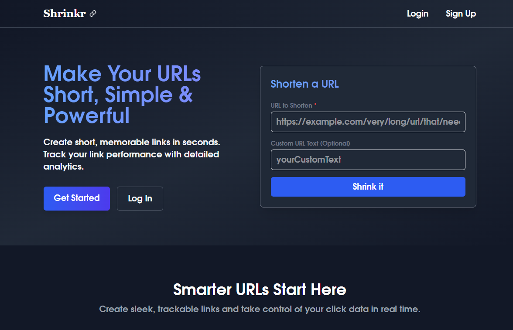

# Shrinkr

**Shrinkr** is a minimal, fast, and reliable URL shortener. Create short, memorable links in seconds and track your link performance with detailed analytics.



## Features

- 🔗 Shorten long URLs instantly
- 📝 Custom short URLs
- 📊 Track link analytics
- ✨ Simple, modern, and responsive UI

## Getting Started

1. **Clone the repository:**
   ```bash
   git clone https://github.com/Sandeep-Petwal/Shrinkr-FE.git
   cd Shrinkr
   ```

2. **Install dependencies:**
   ```bash
   npm install
   ```

3. **Start the development server:**
   ```bash
   npm start
   ```

4. **Open in your browser:**
   ```
   http://localhost:3000
   ```

## Tech Stack

- React
- Tailwind CSS
- React Router
- Lucide Icons

## Author

Made with ❤️ by [Sandeep Prasad](https://sandeepprasad.xyz/)
